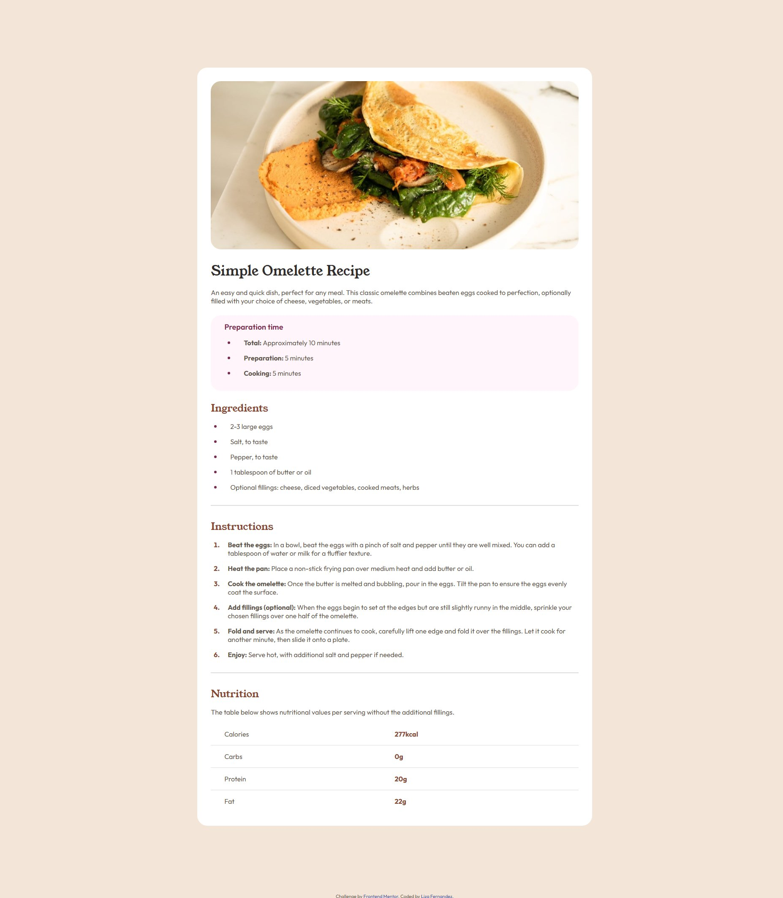
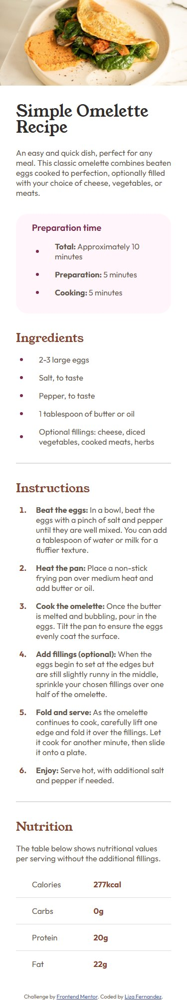

# Frontend Mentor - Recipe page solution

This is a solution to the [Recipe page challenge on Frontend Mentor](https://www.frontendmentor.io/challenges/recipe-page-KiTsR8QQKm). Frontend Mentor challenges help you improve your coding skills by building realistic projects.

## Table of contents

- [Overview](#overview)
  - [The challenge](#the-challenge)
  - [Screenshot](#screenshot)
  - [Links](#links)
- [My process](#my-process)
  - [Built with](#built-with)
  - [What I learned](#what-i-learned)
  - [Continued development](#continued-development)
  - [Useful resources](#useful-resources)
- [Author](#author)

## Overview

### Screenshot

#### Desktop View



#### Mobile View



### Links

- Solution URL: [Add solution URL here](https://your-solution-url.com)
- Live Site URL: [https://recipe-page-challenge-solution-01.netlify.app](https://recipe-page-challenge-solution-01.netlify.app)

## My process

### Built with

- Semantic HTML5 markup
- CSS custom properties
- Flexbox
- Mobile-first workflow

### What I learned

My major learning outcomes from this challenge was working with a mobile-first workflow and styling both ordered and unordered lists. In particular, I learned how to use pseudo elements to style the bullet point markers and spacing of lists.

Seen below are CSS code snippets where I used pseudo elements to style lists.

```css
ul li::before {
  content: " ";
  display: block;
  border: solid 0.2em var(--Rose-800);
  border-radius: 0.5em;
  margin-right: 2rem;
  margin-left: -1rem;
  padding-left: 0px;
}

ol > li::marker {
  font-weight: bold;
  color: var(--Brown-800);
}
```

### Continued development

In the future I would like to work more with lists and get used to styling them with pseudo elements. I would also like to continue practicing using a mobile-first workflow.

### Useful resources

- [Stackoverflow](https://stackoverflow.com/questions/21369843/is-there-a-way-to-make-numbers-in-an-ordered-list-bold) - I had an issue making the numbers in the ordered list to be bold, the solution by Kevinoid worked
- [YouTube Video by CSS Express](https://www.youtube.com/watch?v=w9gVDgFzPO8) - This video helped me solve my problem of vertically centering the bullet points in the preparation section of index.html

- [W3Schools How to CSS style HR](https://www.w3schools.com/howto/howto_css_style_hr.asp) - This page helped me understand how to style a horizontal ruler/line element

## Author

- Website - [Liza Fernandez](https://lizafernandez.dev)
- Frontend Mentor - [@aelvanna](https://www.frontendmentor.io/profile/aelvanna)
